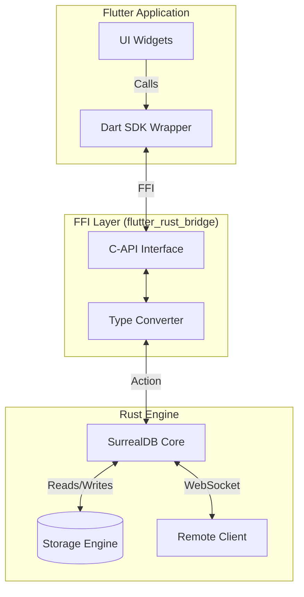
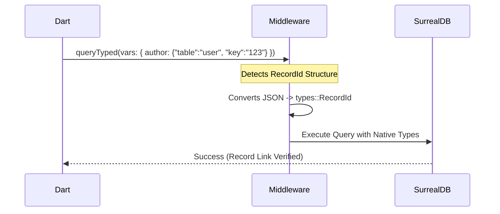

# Flutter SurrealDB Engine


[](https://pub.dev/packages/flutter_surrealdb_engine)
[](https://opensource.org/licenses/MIT)

**The ultimate SurrealDB integration for Flutter.** 

Embed a full SurrealDB instance directly into your iOS, Android, macOS, Windows, and Linux apps, or connect to a remote server with a unified, high-performance API.

---

## ⚡ Features

*   **📱 Embedded Engine**: Run SurrealDB locally on-device. No internet required.
*   **🔄 Sync Ready**: Perfect foundation for offline-first apps that sync when online.
*   **🚀 High Performance**: Zero-copy (where possible) FFI bridge to the official Rust core.
*   **🛠 Type-Safe Queries**: strict schema support with client-side RecordID parsing.
*   **📡 Live Queries**: Real-time subscriptions to table changes.
*   **🔐 Auth & Security**: Built-in JWT handling, Scope authentication, and RBAC.

---

## 🏗 Architecture

`flutter_surrealdb_engine` bridges the gap between Dart and the high-performance Rust core of SurrealDB.



### How it Works

1.  **Dart Layer**: You interact with a clean, idiomatic Dart API (`SurrealDb`).
2.  **FFI Bridge**: Calls are significantly faster than MethodChannels because they compile directly to native machine code.
3.  **Rust Middleware**: We've implemented a smart middleware (via `queryTyped`) that intercepts your Dart objects (like `RecordId`) and converts them into native SurrealDB types before they even hit the database engine.
4.  **Engine**: The query is executed by the actual embedded SurrealDB library (the exactly same one running on servers).

---

## 🚀 Getting Started

### 1. Installation

Add the package to your `pubspec.yaml`:

```yaml
dependencies:
  flutter_surrealdb_engine: ^0.1.0
```

### 2. Initialization

Initialize the Rust bridge in your `main.dart` before running the app.

```dart
import 'package:flutter_surrealdb_engine/flutter_surrealdb_engine.dart';

void main() async {
  WidgetsFlutterBinding.ensureInitialized();
  
  // Initialize the native rust library
  await RustLib.init();
  
  runApp(const MyApp());
}
```

---

## 💡 Usage Examples

### Connecting

Choose your storage strategy based on your use case.

```dart
// 1. In-Memory (Great for testing/cache)
final db = await SurrealDb.connect(
  mode: const StorageMode.memory(),
);

// 2. Persistent Local Storage (Offline-first apps)
final db = await SurrealDb.connect(
  mode: const StorageMode.disk(path: 'docs/my_app.db'),
);

// 3. Remote Server (Traditional backend)
final db = await SurrealDb.connect(
  mode: const StorageMode.remote(url: 'ws://localhost:8000/rpc'),
);
```

### Authentication

Support for both root (admin) access and scoped user authentication.

```dart
// Admin Access
await db.signin(
  creds: jsonEncode({"user": "root", "pass": "root"}),
);

// User Authentication (Scope)
final token = await db.signin(
  creds: jsonEncode({
    "NS": "my_ns",
    "DB": "my_db",
    "SC": "user_scope",
    "user": "john_doe",
    "pass": "123456",
  }),
);
```

### CRUD Operations

Standard operations are simple and async.

```dart
// CREATE
final user = await db.create(
  resource: 'user', 
  data: jsonEncode({'name': 'John', 'role': 'admin'}),
);

// SELECT
final users = await db.select(resource: 'user');

// UPDATE
await db.merge(
  resource: 'user:john', 
  data: jsonEncode({'active': true}),
);

// DELETE
await db.delete(resource: 'user:john');
```

---

## 🧠 Advanced: Typed Queries & Strict Schemas

If your database uses `SCHEMAFULL` with strictly typed `record<table_name>` fields, generic JSON strings won't pass validation. 

Use **`queryTyped`** and the **`RecordId`** helper class to solve this.

### The Problem
Sending `author: "user:123"` in a JSON string gets interpreted as a simple String, causing a schema mismatch error.

### The Solution

```dart
import 'package:flutter_surrealdb_engine/flutter_surrealdb_engine.dart';

// 1. Create a strongly typed RecordId
final authorId = RecordId.fromString("user:123");

// 2. Use queryTyped
await db.queryTyped(
  sql: "CREATE post CONTENT $data",
  vars: jsonEncode({
    "data": {
      "title": "My Deep Dive",
      // This is automatically converted to a native Record Link!
      "author": authorId 
    }
  }),
);
```

**Sequence Diagram:**



---

## 📡 Live Queries (Realtime)

Subscribe to changes in real-time. This works for both local and remote databases!

```dart
final stream = db.liveQuery(
  tableName: 'notification',
  snapshot: true, // Get existing data first?
);

stream.listen((event) {
  switch (event.action) {
    case Action.CREATE:
      print("New notification: ${event.result}");
      break;
    case Action.UPDATE:
      print("Updated notification: ${event.result}");
      break;
    case Action.DELETE:
      print("Deleted notification: ${event.result}");
      break;
  }
});
```

---

## 🤝 Contributing

We welcome contributions! Please open an issue or submit a PR.

1.  Fork the repo
2.  Create your feature branch (`git checkout -b feature/amazing-feature`)
3.  Commit your changes (`git commit -m 'Add some amazing feature'`)
4.  Push to the branch (`git push origin feature/amazing-feature`)
5.  Open a Pull Request
