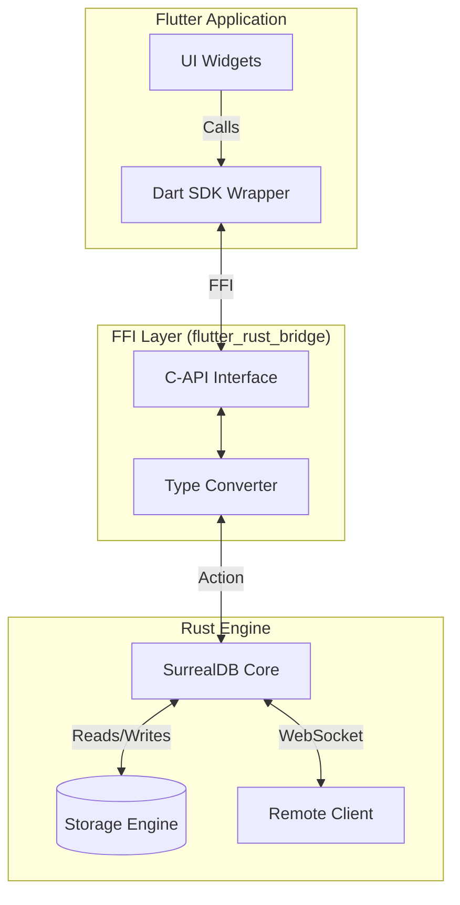

# Flutter SurrealDB Engine


[](https://pub.dev/packages/flutter_surrealdb_engine)
[](https://opensource.org/licenses/MIT)

**The ultimate SurrealDB integration for Flutter.** 

Embed a full SurrealDB instance directly into your iOS, Android, macOS, Windows, and Linux apps, or connect to a remote server with a unified, high-performance API.

---

## ⚡ Features

*   **📱 Embedded Engine**: Run SurrealDB locally on-device. No internet required.
*   **🔄 Sync Ready**: Perfect foundation for offline-first apps that sync when online.
*   **🚀 High Performance**: Zero-copy (where possible) FFI bridge to the official Rust core.
*   **🛠 Type-Safe Queries**: strict schema support with client-side RecordID parsing.
*   **📡 Live Queries**: Real-time subscriptions to table changes.
*   **🔐 Auth & Security**: Built-in JWT handling, Scope authentication, and RBAC.

---

## 🏗 Architecture

`flutter_surrealdb_engine` bridges the gap between Dart and the high-performance Rust core of SurrealDB.



---

## 🚀 Getting Started

### 1. Installation

Add the package to your `pubspec.yaml`:

```yaml
dependencies:
  flutter_surrealdb_engine: ^0.1.0
```

### 2. Initialization

Initialize the Rust bridge in your `main.dart` before running the app.

```dart
import 'package:flutter_surrealdb_engine/flutter_surrealdb_engine.dart';

void main() async {
  WidgetsFlutterBinding.ensureInitialized();
  
  // Initialize the native rust library
  await RustLib.init();
  
  runApp(const MyApp());
}
```

---

## � API Reference

### 🔌 Connection

#### `connect`
Establish a connection to the database. Supports Memory, File (Embedded), and Remote (WebSocket/HTTP) modes.

```dart
// 1. In-Memory (Great for testing/cache)
final db = await SurrealDb.connect(mode: const StorageMode.memory());

// 2. Persistent Local Storage (Offline-first apps)
final db = await SurrealDb.connect(mode: const StorageMode.disk(path: 'docs/my_app.db'));

// 3. Remote Server (Traditional backend)
final db = await SurrealDb.connect(mode: const StorageMode.remote(url: 'ws://localhost:8000/rpc'));
```

#### `useDb`
Switch to a specific namespace and database.

```dart
await db.useDb(ns: 'test', db: 'test');
```

#### `close`
Close the database connection and release resources.

```dart
await db.close();
```

---

### 🔐 Authentication

#### `signin`
Sign in with credentials. Supports both root auth and scoped users.

```dart
// Root/Admin Signin
await db.signin(creds: jsonEncode({
  "user": "root",
  "pass": "root"
}));

// Scoped User Signin
final jwt = await db.signin(creds: jsonEncode({
  "NS": "test",
  "DB": "test",
  "SC": "user_scope",
  "user": "john_doe",
  "pass": "123456"
}));
```

#### `signup`
Register a new user within a scope.

```dart
final jwt = await db.signup(creds: jsonEncode({
  "NS": "test",
  "DB": "test",
  "SC": "user_scope",
  "user": "jane_doe",
  "pass": "secureparams"
}));
```

#### `authenticate`
Authenticate using a previously obtained JWT token.

```dart
await db.authenticate(token: jwtToken);
```

#### `invalidate`
Invalidate the current session/authentication.

```dart
await db.invalidate();
```

---

### 💾 CRUD Operations

#### `create`
Create a new record.

```dart
// Create a specific record
final user = await db.create(
  resource: 'user', 
  data: jsonEncode({'name': 'John', 'role': 'admin'}),
);
```

#### `select`
Select all records from a table or a specific record.

```dart
// Select all users
final users = await db.select(resource: 'user');

// Select a specific user
final user = await db.select(resource: 'user:john');
```

#### `update`
Update a record (replaces the entire content).

```dart
await db.update(
  resource: 'user:john', 
  data: jsonEncode({'name': 'John Doe', 'role': 'user'}),
);
```

#### `merge`
Merge data into an existing record (partial update).

```dart
await db.merge(
  resource: 'user:john', 
  data: jsonEncode({'active': true}),
);
```

#### `delete`
Delete a record or an entire table.

```dart
await db.delete(resource: 'user:john');
```

---

### 🔍 SQL Queries

#### `query`
Execute raw SQL queries with optional variable binding.

```dart
final result = await db.query(
  sql: "SELECT * FROM user WHERE age > \$min_age", 
  vars: jsonEncode({'min_age': 18}),
);
```

#### `queryTyped` (Strict Schema Support)
Execute queries while preserving strict types (e.g., `record<table_name>`) that JSON normally destroys.

```dart
final authorId = RecordId.fromString("user:123");

await db.queryTyped(
  sql: "CREATE post CONTENT $data",
  vars: jsonEncode({
    "data": {
      "title": "My Article",
      "author": authorId // Automatically handled as a Record Link
    }
  }),
);
```

---

### 📡 Live Queries (Realtime)

#### `liveQuery`
Subscribe to real-time changes on a table.

```dart
// Subscribe to the 'notification' table
final stream = db.liveQuery(
  tableName: 'notification',
  snapshot: true, // If true, returns all existing records first
);

stream.listen((event) {
  switch (event.action) {
    case Action.CREATE:
      print("Created: ${event.result}");
      break;
    case Action.UPDATE:
      print("Updated: ${event.result}");
      break;
    case Action.DELETE:
      print("Deleted: ${event.result}");
      break;
  }
});
```

#### `killQuery`
Manually kill a live query if needed (usually handled automatically by cancelling the stream subscription).

```dart
await SurrealDb.killQuery(queryUuid: 'uuid-from-event');
```

---

### 📦 Transactions

#### Manual Transaction Control
For fine-grained control over transactions.

```dart
await db.queryBegin();
try {
  await db.create(resource: 'user', data: ...);
  await db.create(resource: 'log', data: ...);
  await db.queryCommit();
} catch (e) {
  await db.queryCancel();
}
```

#### `transaction` Helper
Execute a set of statements within a transaction macro.

```dart
await db.transaction(
  stmts: "CREATE user:1; CREATE account:1;",
);
```

---

### 🛠 Utilities

#### `export_`
Export the database to a file (for backups).

```dart
await db.export_(path: '/path/to/backup.surql');
```

---

## 🤝 Contributing

We welcome contributions! Please open an issue or submit a PR.

1.  Fork the repo
2.  Create your feature branch (`git checkout -b feature/amazing-feature`)
3.  Commit your changes (`git commit -m 'Add some amazing feature'`)
4.  Push to the branch (`git push origin feature/amazing-feature`)
5.  Open a Pull Request
